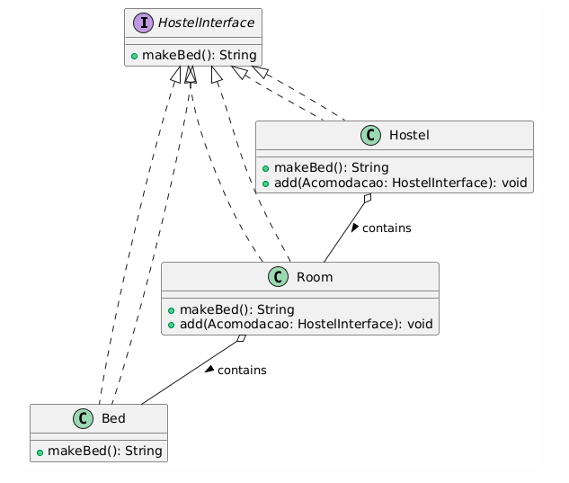

# Composite

Composite is a solution to represent an only object and them collective of that objects. The composite are a tree structure, where the leafs are the objects and the composite are the part-whole.
It's important the leafs and the tree structure are the same type, in the same hierarchy.
If you have a tree structure, you can use the composite pattern with recursive methods.

## Problems:

Without composite, or there are same methods to leaf and structure tree. Or both will have to inherit from a superclass, which can lead to a problem of rigidity in the design. This happens because, by forcing all objects to inherit from a superclass, you may limit the system's flexibility and introduce unnecessary dependencies. Additionally, this can violate the principle of composition over inheritance, making code reuse and maintenance more difficult.

## How implement it?

But, what mean the "same type"? Mean the leaf and the tree structure could be the same behavior, and the leaf is part of the tree structure. Like Hostel, one bed is part of the room's hostel, and the room is part of the hostel. The room and the bed are the same type, but the bed is a leaf and the room is a composite.

Make the bed in this context of "same behavior", if organize every bed, you organize the room. If you organize the room, you organize the hostel. So, when use the method `makeBed()` at room, the method `makeBed()` at bed is called.

To implement the Composite pattern, it is necessary to use the same interface for all objects. The interface is responsible for defining the common behavior of both leaves and composites.

The interface for the hostel is HostelInterface, which is implemented by Hostel, Room, and Bed. The class Hostel is the top-level composite, and the class Room is also a composite because it contains multiple beds. The class Bed is a leaf, as it does not contain any further elements.

HostelInterface defines the method public String makeBed(), which ensures that beds can be made whether they belong to a single room or the entire hostel.

## UML

## Anti-Patterns

The problem is the lack of a common interface, making the code rigid, duplicated, and difficult to extend, as Hostel can only call Room, which can only call Bed, tightly coupling the code.

That implement code [here](AntiPatterns.Java)

## Patterns

That implement code [here](DatabaseSingleton.Java)

1 - **Global Variables** - singleton look like global vars, is a bad practice, because you can't control the access to the object.

2 - **Static Classes** - is a bad practice, because you can't control the access to the object.

3 - **Single Responsibility Principle** - Since Singleton is designed as a single class, it often violates this principle by having multiple responsibilities. This is considered a bad practice because it makes the object's access control more difficult.

## Reffers

https://www.coursera.org/learn/design-patterns/lecture/hWt11/2-1-3-singleton-pattern

https://www.youtube.com/watch?v=x9h8MgAvi_I

https://refactoring.guru/design-patterns/singleton/java/example