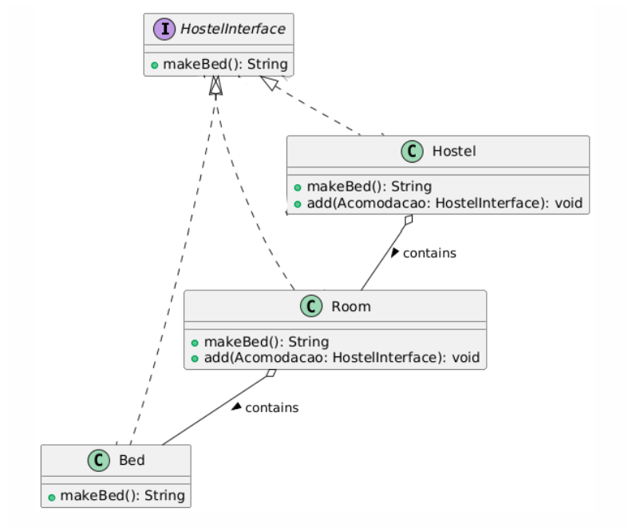

# Composite

The **Composite** pattern is a solution for representing a single object as well as a collection of objects with the same behavior to recursive problems. A composite follows a **tree structure**, where:

- **Leaves** are simple objects.
- **The composite** is the tree structure that groups multiple leaves.
- **The interface** defines the common behavior of both leaves and composites.

It is important that both leaves and the tree structure share the same type and belong to the same hierarchy. The pattern itself is named **Composite** because it represents a "part-whole" relationship.

## Main Components

- **Leaf** – A simple object.
- **Composite** – A tree structure containing groups of leaves.
- **Interface** – Defines the common behavior of both leaves and composites.

If you have a tree structure, you can use the **Composite** pattern along with recursive methods to manage its elements efficiently.

Recursive is de key! Because it's hard tratramenting a tree structure without recursion. The Composite pattern allows you to treat both leaves and composites uniformly, making it easier to manage the entire structure.

## Problems:

Without composite, or there are same methods to leaf and structure tree. Or both will have to inherit from a superclass, which can lead to a problem of rigidity in the design. This happens because, by forcing all objects to inherit from a superclass, you may limit the system's flexibility and introduce unnecessary dependencies. Additionally, this can violate the principle of composition over inheritance, making code reuse and maintenance more difficult.

Also, if is necessary use recursive methods, the code will be more complex and difficult to maintain. This is because you will have to write separate methods for each type of object, leading to code duplication and increased complexity.    

## How implement it?

But, what mean the "same type"? Mean the leaf and the tree structure could be extend of the same interface, because the leaf is part of the tree structure. Like Hostel, one bed is part of the room's hostel, and the room is part of the hostel. The room and the bed are the same type, but the bed is a leaf and the room is a composite. And the hostel is a composite of rooms.

Make the bed in this context of "same behavior", because both the bed and the room can be tidied up in different ways. About bed, is necessary `makeBed()`, at room is need `clearFloar()` and `makeBed()`, at hostel is necessary `balanceCashRegister()`, `clearFloar()` in the rooms and `makeBed()` to organize everything. 

In the way, you don't need repeat code for every class `makeBed()` when you want organize all hostel, because the method `makeBed()` is part of logic `HostelInterfaceCleanUp()` into  `organize()` when is implements in the class `Room`, and, when we call `organize()` in class `hostel`, that will call `organize()` in `List Accommodations accommodations`, the with and the class `bed

So, when use the method `makeBed()` at room, the method `makeBed()` at bed is called.

To implement the Composite pattern, it is necessary to use the same interface for all objects. The interface is responsible for defining the common behavior of both leaves and composites.

The interface for the hostel is HostelInterface, which is implemented by Hostvoltei
el, Room, and Bed. The class Hostel is the top-level composite, and the class Room is also a composite because it contains multiple beds. The class Bed is a leaf, as it does not contain any further elements.

HostelInterface defines the method public String makeBed(), which ensures that beds can be made whether they belong to a single room or the entire hostel.

## UML

## Anti-Patterns

The problem is the lack of a common interface, making the code rigid, duplicated, and difficult to extend, as Hostel can only call Room, which can only call Bed, tightly coupling the code.

That implement code [here](AntiPatterns.Java)

## Patterns

Here, Hostel is composite with Room. And Room is composite with leaf bead

THe interface dont need logic. 

Composite delega os objetos simples arrumar da sua forma. A recusividade começa a simples e genérico. 
Mas isso não reforça o acoplamento, o fluxo recursivo se propaga automaticamente. Não importo ser simples ou composto. encasupla a estrutura em uma interface unica. 
Isso torna o código mais simples e flexivel para lidar com hierarquias completas. 

That implement code [here](DatabaseSingleton.Java)

1 - **Global Variables** - singleton look like global vars, is a bad practice, because you can't control the access to the object.

2 - **Static Classes** - is a bad practice, because you can't control the access to the object.

3 - **Single Responsibility Principle** - Since Singleton is designed as a single class, it often violates this principle by having multiple responsibilities. This is considered a bad practice because it makes the object's access control more difficult.

## Reffers

https://www.coursera.org/learn/design-patterns/lecture/hWt11/2-1-3-singleton-pattern

https://www.youtube.com/watch?v=x9h8MgAvi_I

https://refactoring.guru/design-patterns/singleton/java/example

modificar a agregação para que seja o objeto permeavel. 