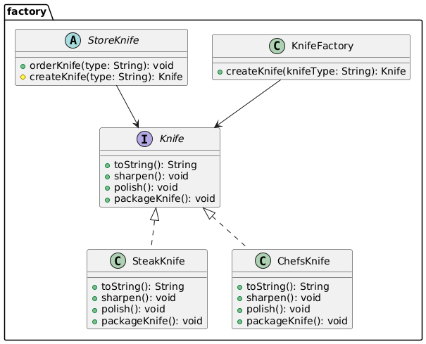

# Factory

## Problems:

When the creation logic is not encapsulated, several issues can arise, such as code duplication and the risk of inconsistencies or bugs if the creation process changes.
Additionally, it violates the Single Responsibility Principle, since the class is responsible for both creating the object and deciding which methods to call.
Finally, encapsulating creation logic in a specific place improves the scalability and flexibility of the code. 

## How implement it?

The factory pattern delegate the responsability of creation the object. A Factory. And the code decide which subclass will instantiate and concentrate the logic of the creation in one place.

## UML

## Anti-Patterns

That implement code [here](AntiPatternFactory.Java)

## Patterns

That implement code [here](KnowFactory.Java)

1 - **Interface** - An interface or abstract class is required to define the contract for the product that will be created by the factory.

2 - **Factory** The create's logic must be isolate in the factory. The client code must not know how to create the object. The factory!

3 - **Instance** - the instance of the factory in class. 

## Reffers

https://www.coursera.org/learn/design-patterns/lecture/LIUcy/2-1-4-factory-method-pattern

https://www.youtube.com/watch?v=x9h8MgAvi_I

https://refactoring.guru/design-patterns/singleton/java/example