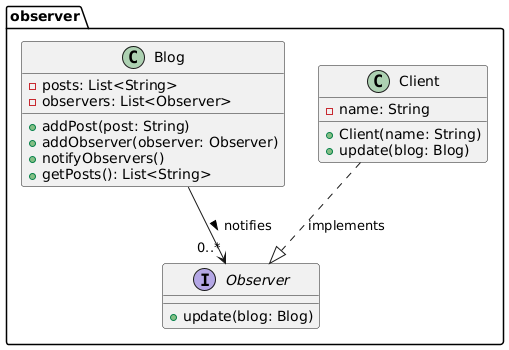

# Observer

## Problems:

Without the observer pattern, your code must constantly poll or check whether the state has changed — which leads to inefficiency and tightly coupled logic.

With the observer pattern, the responsibility of notification belongs to the subject (the state holder), not the dependent process.
When the state changes, it automatically notifies all registered observers.

The biggest problem is the constante Polling!

## How implement it?

The Subject holds a list of Observers.

When the Subject’s state changes, it calls notifyObservers().

All registered Observers are notified and react accordingly through the update() method.

## UML

## Anti-Patterns

That implement code [here](AntiPatternObserver.java)

## Patterns

That implement code [here](Blog.Java)
Blog
1 - **Product** - Subject / Observable – Holds the state and notifies observers

2 - **Client** Observer – Implements update() and reacts to changes

3 - **Posts** - The product being observed – represents new content added to the system

## Reffers

https://www.coursera.org/learn/design-patterns/lecture/LIUcy/2-1-4-factory-method-pattern

https://refactoring.guru/design-patterns/observer