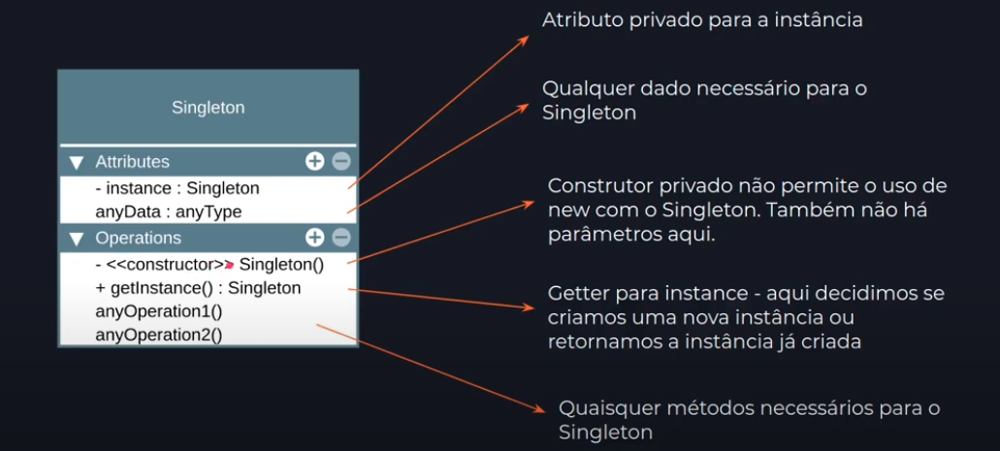

# Singleton
The singular class.

A creational pattern, and has **one object of a class**. Because is necessary to have **only one instance of a class**, and provides a global point of access to it. 

## Problems:
1 - Ensure thath a class has just a single instance! Because you need control access to some shared resource (like configs), like a file, or a database connection.
Singleton, if you try create a new object from the class, the software will return the same object.
Modules has to be aware of the singleton, because it's a global variable.

2 - Provide a global access point to that instance.

## How implement it?

1º - turn the constructor private, that way, nobody can use new operator class.
2º - Create a static creation method for return the cached object! That way you ensure that the class has only one instance and return the same instance. 

https://www.coursera.org/learn/design-patterns/lecture/hWt11/2-1-3-singleton-pattern

## UML

## Anti-Patterns

That implement code [here](AntiPatterns.Java)

## Patterns

That implement code [here](DatabaseSingleton.Java)

1 - **Global Variables** - singleton look like global vars, is a bad practice, because you can't control the access to the object.

2 - **Static Classes** - is a bad practice, because you can't control the access to the object.

3 - **Single Responsibility Principle** - Since Singleton is designed as a single class, it often violates this principle by having multiple responsibilities. This is considered a bad practice because it makes the object's access control more difficult.

## Reffers

https://www.coursera.org/learn/design-patterns/lecture/hWt11/2-1-3-singleton-pattern

https://www.youtube.com/watch?v=x9h8MgAvi_I

https://refactoring.guru/design-patterns/singleton/java/example