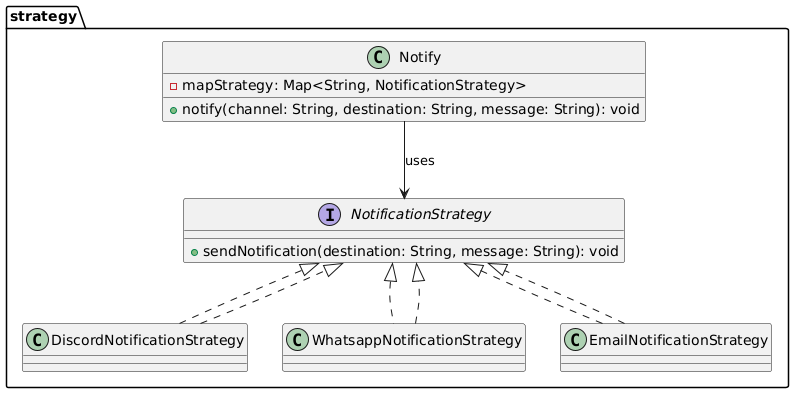

# Strategy

## Problem

Sometimes a class needs to solve a problem in different ways for different clients.  
To handle this, it often uses many `if-else` statements to choose which algorithm to run.

This becomes a problem when the class has to support multiple implementations of the same task.  
It violates the **Open/Closed Principle**, which says that classes should be **open for extension but closed for modification**.

So, every time we want to add a new algorithm, we need to change the existing code. This increases the chance of bugs and makes the code harder to maintain.

## How to implement it?

The **Strategy Pattern** is a behavioral design pattern.  
It requires an interface that defines the algorithm.  
Then, we create multiple classes that implement this interface — each with a different version of the algorithm.  

The client code chooses which implementation to use **at runtime**.

## UML

## Anti-Pattern

An example of a bad implementation is shown [here](AntiPatternStrategy.Java)

## Pattern

A correct implementation is shown [here](Notify.Java)

1. **Interface** – We need an interface (or abstract class) that defines the common method(s).  
Each strategy class implements this interface in a different way.  
The interface should only define method signatures, not contain logic.  
Example: [NotificationStrategy.java](NotificationStrategy.java)

2. **Strategies** – We can organize the different implementations into a package.  
Each class provides a specific version of the algorithm.  
Examples:  
- [Discord](./strategysways/DiscordNotificationStrategy.java)  
- [Email](./strategysways/EmailNotificationStrategy.java)  
- [Whatsapp](./strategysways/WhatsappNotificationStrategy.java)

3. **Instance** – In the main class, we use a `Map` to choose the right strategy implementation.  
The client can then call the method directly.  
Example: [Notify.java](Notify.java)

## References

- [YouTube - Strategy Pattern](https://www.youtube.com/watch?v=i6hi2YGsiXU&t=197s)  
- [Refactoring Guru - Strategy Pattern](https://refactoring.guru/pt-br/design-patterns/strategy)
